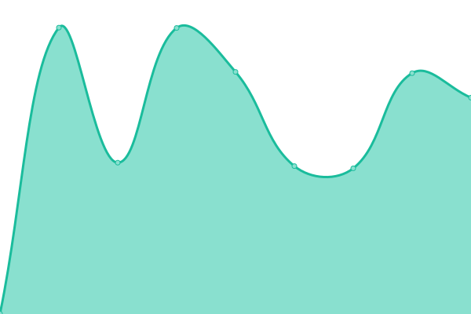

# [📈 Live Status](https://status.grycap.net): <!--live status--> **🟩 All systems operational**

This repository contains the open-source uptime monitor and status page for [GRyCAP](www.grycap.upv.es) research group, powered by [Upptime](https://github.com/upptime/upptime).

With [Upptime](https://upptime.js.org), you can get your own unlimited and free uptime monitor and status page, powered entirely by a GitHub repository. We use [Issues](https://github.com/upptime/upptime/issues) as incident reports, [Actions](https://github.com/grycap/status/actions) as uptime monitors, and [Pages](https://demo.upptime.js.org) for the status page.

<!--start: status pages-->
<!-- This summary is generated by Upptime (https://github.com/upptime/upptime) -->
<!-- Do not edit this manually, your changes will be overwritten -->
<!-- prettier-ignore -->
| URL | Status | History | Response Time | Uptime |
| --- | ------ | ------- | ------------- | ------ |
|  [IM-Dashboard](https://appsgrycap.i3m.upv.es/im-dashboard/login) | 🟩 Up | [im-dashboard.yml](https://github.com/grycap/status/commits/HEAD/history/im-dashboard.yml) | 

 604ms
     
 | 

<a href="https://status.grycap.net/history/im-dashboard">100.00%</a>
    

|  [IM Server](https://appsgrycap.i3m.upv.es/im/version) | 🟩 Up | [im-server.yml](https://github.com/grycap/status/commits/HEAD/history/im-server.yml) | 

 126ms
     
 | 

<a href="https://status.grycap.net/history/im-server">100.00%</a>
    

|  [CloudTrail-Tracker](https://cloudtrailtracker.cursocloudaws.net/) | 🟩 Up | [cloud-trail-tracker.yml](https://github.com/grycap/status/commits/HEAD/history/cloud-trail-tracker.yml) | 

 134ms
     
 | 

<a href="https://status.grycap.net/history/cloud-trail-tracker">100.00%</a>
    

|  [OSCAR Cluster - Sandbox](https://oscar.test.fedcloud.eu) | 🟩 Up | [oscar-cluster-sandbox.yml](https://github.com/grycap/status/commits/HEAD/history/oscar-cluster-sandbox.yml) | 

 790ms
     
 | 

<a href="https://status.grycap.net/history/oscar-cluster-sandbox">100.00%</a>
    

|  [OSCAR Cluster - AI4EOSC](https://inference.cloud.ai4eosc.eu) | 🟩 Up | [oscar-cluster-ai-4-eosc.yml](https://github.com/grycap/status/commits/HEAD/history/oscar-cluster-ai-4-eosc.yml) | 

 995ms
     
 | 

<a href="https://status.grycap.net/history/oscar-cluster-ai-4-eosc">100.00%</a>
    

|  [OSCAR Cluster - iMagine](https://inference-walton.cloud.imagine-ai.eu) | 🟩 Up | [oscar-cluster-i-magine.yml](https://github.com/grycap/status/commits/HEAD/history/oscar-cluster-i-magine.yml) | 

 1009ms
     
 | 

<a href="https://status.grycap.net/history/oscar-cluster-i-magine">99.69%</a>
    

|  [OSCAR Cluster - interTwin](https://oscar-ukri.intertwin.fedcloud.eu) | 🟩 Up | [oscar-cluster-inter-twin.yml](https://github.com/grycap/status/commits/HEAD/history/oscar-cluster-inter-twin.yml) | 

 658ms
     
 | 

<a href="https://status.grycap.net/history/oscar-cluster-inter-twin">98.56%</a>
    

<!--end: status pages-->

[**Visit our status website →**](https://status.grycap.net)

## 📄 License

- Powered by: [Upptime](https://github.com/upptime/upptime)
- Code: [MIT](./LICENSE) © [Upptime](https://upptime.js.org)
- Data in the `./history` directory: [Open Database License](https://opendatacommons.org/licenses/odbl/1-0/)
